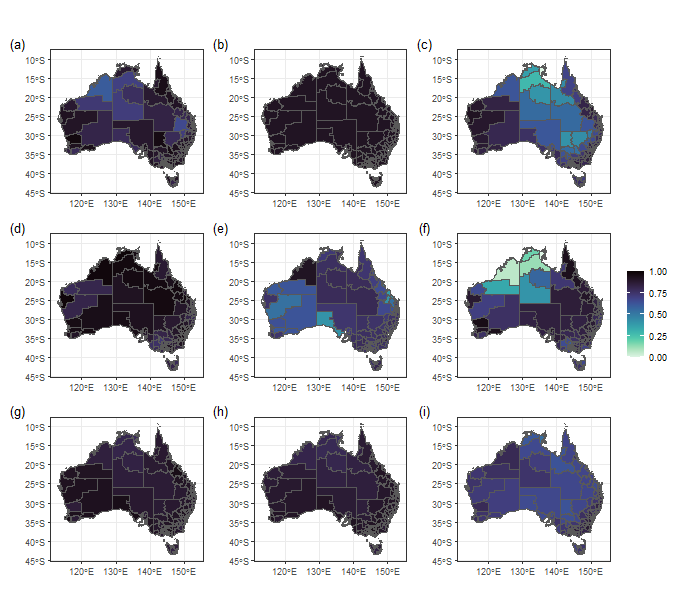

# Calculation methods of geographical complexity

The formula for *shannon entropy* is as follows:

$$
H(X) = - \sum_{i=1}^{n} p(x_i) \log_b p(x_i)
$$

Where $H(X)$ is entropy of the random variable $X$, $p(x_i)$ is probability of the random variable $X$ taking the value $x_i$, $n$is number of possible values that $X$ can take, $b$ is the base of the logarithm, which can be 2 (for bits), $e$ (natural logarithm, for nats), or 10 (for dits).

The *spatial variance* is calculated as:

$$
\Gamma = \frac{\sum_i \sum_{j \neq i} \omega_{ij}\frac{(y_i-y_j)^2}{2}}{\sum_i \sum_{j \neq i} \omega_{ij}}
$$

where $\omega_{ij}$ is the weight between $i$-th location and
$j$-th location; $y_i$ and $y_j$ are the dependent variable values
at the $i$-th and $j$-th locations respectively.

The geographical configuration similarity is calculated as:

$$
S({\bf u}_{\alpha},{\bf v}_{\beta})=min\{E_{i}(e_{i}({\bf u}_{\alpha}),e_{i}({\bf v}_{\beta}))\}
$$

$$
E_{i}({\bf u}_{\alpha},{\bf v}_{\beta})=\exp\left(-{\frac{\left(e_{i}({\bf u}_{\alpha})-e_{i}({\bf v}_{\beta})\right)^{2}}{2\left(\sigma^{2}/\delta({\bf v}_{\beta})\right)^{2}}}\right)
$$

$$
\delta({\bf u}_{\alpha},{\bf v})=\sqrt{\frac{\sum_{\beta=1}^{n}(e({\bf u}_{\alpha})-e({\bf v}_{\beta}))^{2}}{n}}
$$

## Considering the geographical complexity with spatial local dependencies

The formula for geocomplexity which uses local moran measure method is

$$
\rho_i = -\frac{1}{m} Z_i \sum\limits_{j=1}^m W_{ij} Z_j -\frac{1}{m} \sum\limits_{j=1}^m W_{ij} Z_j \frac{1}{V_{k}}\sum\limits_{k=1}^n W_{jk} W_{ik} Z_k
$$

The formula for geocomplexity which uses spatial fluctuation measure
method is

$$
\rho_i = Spatial\_Variance(z_i,z_j)
$$

The formula for geocomplexity which uses shannon entropy measure
method is

$$
\rho_i = Shannon\_Entropy(Z_i,Z_j)
$$

## Considering the geographical complexity with geographical configurations similarities

### Firstly, calculate global similarity:

$$
S = CosineSimilarity(Z_i,Z_j)
$$

or

$$
S = GeographicalConfigurationsSimilarity(Z_i,Z_j)
$$

### The geographic complexity is then calculated:

The formula for geocomplexity which uses spatial fluctuation measure
method is

$$
\rho_i = Spatial\_Variance(S_i,S_j)
$$

The formula for geocomplexity which uses shannon entropy measure
method is

$$
\rho_i = Shannon\_Entropy(S_i,S_j)
$$

# Cases for computing geographical complexity

## Geographical Complexity of Individual Variables


``` r
library(sf)
library(geocomplexity)
library(ggplot2)
library(viridis)
library(patchwork)
econineq = sf::read_sf(system.file('extdata/econineq.gpkg',package = 'geocomplexity'))
gc = geocd_vector(econineq)
gc
## Simple feature collection with 333 features and 9 fields
## Geometry type: MULTIPOLYGON
## Dimension:     XY
## Bounding box:  xmin: 112.9211 ymin: -43.63311 xmax: 153.6299 ymax: -9.223927
## Geodetic CRS:  GDA94
## # A tibble: 333 × 10
##    GC_Gini GC_Induscale GC_IT GC_Income GC_Sexrat GC_Houseown GC_Indemp GC_Indcom GC_Hiedu
##      <dbl>        <dbl> <dbl>     <dbl>     <dbl>       <dbl>     <dbl>     <dbl>    <dbl>
##  1   0.899        0.922 0.945     0.952     0.845       0.906     0.858     0.889    0.924
##  2   0.895        0.919 0.849     0.925     0.770       0.825     0.853     0.872    0.877
##  3   0.922        0.919 0.861     0.914     0.729       0.759     0.888     0.911    0.877
##  4   0.921        0.919 0.834     0.949     0.775       0.807     0.892     0.911    0.863
##  5   0.850        0.924 0.830     0.930     0.778       0.889     0.863     0.886    0.843
##  6   0.944        0.920 0.873     0.956     0.782       0.856     0.865     0.929    0.858
##  7   0.910        0.921 0.891     0.957     0.799       0.865     0.809     0.912    0.834
##  8   0.924        0.919 0.817     0.938     0.810       0.834     0.910     0.911    0.867
##  9   0.929        0.919 0.663     0.901     0.768       0.837     0.911     0.914    0.773
## 10   0.918        0.919 0.841     0.957     0.758       0.863     0.927     0.918    0.823
## # ℹ 323 more rows
## # ℹ 1 more variable: geometry <MULTIPOLYGON [°]>
```


``` r
plot_geocd = \(.x){
  ggplot(gc) +
   geom_sf(aes(fill = gc[,.x,drop = TRUE])) +
   scale_fill_viridis(option = "mako", direction = -1,name = "") +
   theme_bw()
}

fig1 = names(gc)[1:9] %>%
  purrr::map(plot_geocd) %>%
  wrap_plots(ncol = 3, byrow = TRUE,
             guides = "collect") +
  plot_annotation(tag_levels = 'a',
                  tag_prefix = '(',
                  tag_suffix = ')',
                  tag_sep = '',
                  theme = theme(plot.tag = element_text(family = "serif"),
                                plot.tag.position = "topleft"))
fig1
```



## Geographical Complexity of Multiple Variables


``` r
gc_multi = geocs_vector(dplyr::select(econineq,-Gini))
gc_multi
## Simple feature collection with 333 features and 1 field
## Geometry type: MULTIPOLYGON
## Dimension:     XY
## Bounding box:  xmin: 112.9211 ymin: -43.63311 xmax: 153.6299 ymax: -9.223927
## Geodetic CRS:  GDA94
## # A tibble: 333 × 2
##       GC                                                                              geometry
##    <dbl>                                                                    <MULTIPOLYGON [°]>
##  1 0.210 (((149.979 -35.50246, 149.9774 -35.49025, 149.9987 -35.47874, 150.0059 -35.46051, 15…
##  2 0.155 (((148.8041 -35.71402, 148.782 -35.73665, 148.7666 -35.70281, 148.7535 -35.6878, 148…
##  3 0.147 (((150.3754 -35.56524, 150.3725 -35.55018, 150.36 -35.53485, 150.2819 -35.5241, 150.…
##  4 0.213 (((149.0114 -33.93276, 149.0057 -33.94396, 149.013 -33.96863, 149.0114 -33.98291, 14…
##  5 0.184 (((147.7137 -34.16162, 147.7126 -34.17681, 147.728 -34.18633, 147.7443 -34.1801, 147…
##  6 0.353 (((151.485 -33.39868, 151.4645 -33.39985, 151.4539 -33.37713, 151.4415 -33.38963, 15…
##  7 0.307 (((151.485 -33.39868, 151.4839 -33.38366, 151.5049 -33.35415, 151.499 -33.33902, 151…
##  8 0.214 (((149.323 -33.05916, 149.3147 -33.10072, 149.3226 -33.1168, 149.3171 -33.14661, 149…
##  9 0.133 (((149.1264 -33.86642, 149.1349 -33.85089, 149.1314 -33.83058, 149.1155 -33.79723, 1…
## 10 0.180 (((150.5587 -32.75774, 150.5411 -32.75426, 150.527 -32.75969, 150.5182 -32.74934, 15…
## # ℹ 323 more rows
```


``` r
fig2 = ggplot(gc_multi) +
   geom_sf(aes(fill = GC)) +
   scale_fill_viridis(option = "mako", direction = -1) +
   theme_bw()
fig2
```


